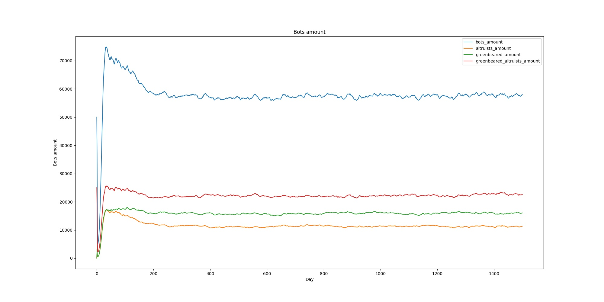
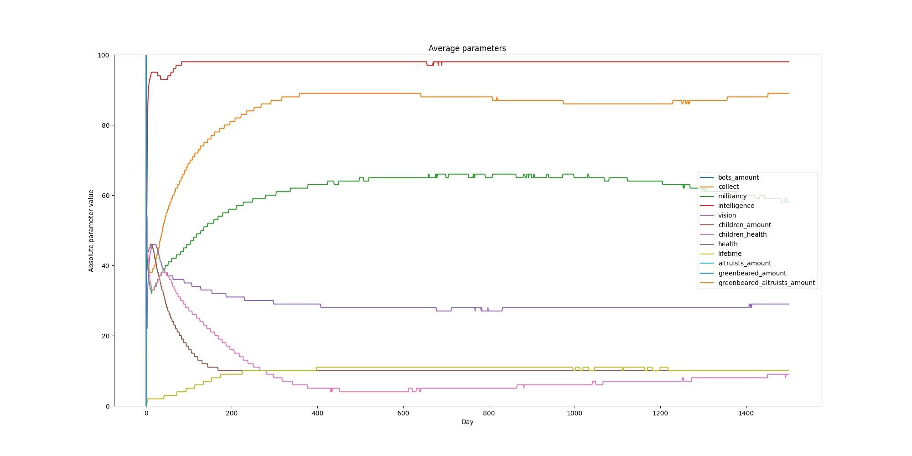

# huy_simulation
*Исследование влияние разных генов на развитие*

Цель проекта понять, какие гены способствуют выживаемости и развитию ботов.
Что будет главным конкурентным преимуществом в столь суровой борьбе за жизнь

# Структура симуляции
Параметры симуляции задаются в мэине `main/main.cpp`

## Популяция
Каждый шаг симуляции будет состоять из одного виртуального дня.
За один день боты будут ходить, взаимодействовать между собой,
бороться за еду и между собой, остерегаться хищников и
уведомлять других о приближающейся опасности

## Бот
Каждый бот будет состоять из двух типов полей
- Геном: наследственные гены, которые влияют на поведение бота и его потомство
    - collect -- отвечает за то, сколько бот соберет еды из клетки
    - militancy -- ген воинственности, с помощью которого определяется победитель в драке
    - vision -- зрение: например, если этот ген равен двум, то бот выбирает куда ему пойти из клеток, которые находятся в радиусе два от него.
    - intelligence -- ген, который отвечает за то, в какую клетку пойдет бот: если он большой, то бот пойдет в клетку с большим количеством еды
    - children_amount -- ген количества детей, котрые родятся при спаривании с другим ботом
    - children_health -- ген здоровья детей
    - is_altruist -- ген альтруизма
    - is_greenbeared -- ген зеленой бороды
- Текущие характеристики: здоровье, время жизни и зашита от врага
    - health -- текущее здоровье, которое также ассоциируется с капиталом, то есть оно может быть больше ста
    - lifetime -- время жизни бота, с каждой итерацией симуляции оно увеличивается на один
    - is_protected -- защищен ли бот на текущий ход от врага. Подробнее будет про это в главе про альттруистов

### Репликация ботов
Если в какой-то клетке оказалось больше, чем два бота, то из них выбираются два лучших согласно этому оператору сравнения ботоа

```cpp
bool operator<(const Bot& first, const Bot& second) {
    return 
        first.collect_ + 
        first.militancy_ + 
        first.intelligence_ + 
        first.health_ -
        3 * first.lifetime_
        <
        second.collect_ + 
        second.militancy_ + 
        second.intelligence_ + 
}
```

Этот оператор складывался из соображений, что крутость бота -- это собирательность, воинственность, интеллект и здоровье.
Однако возраст -- это отрицатлеьная черта, все как в реальной жизни: всех интересуют люди помоложе. Возраст еще идет
и с коэффициентом три, так как все остальные гены колеблятся от 0 до 100 и в среднем они довольно большие, а время жизни
в зависимости от параметров запуска в среднем достигает от 10 до 25.

Таким образом мы определили дву самых привлекательных ботов, теперь нам надо как-то родить детей. Все гены они наследуют,
как среднее арифметическое между мамой и папой, кроме здоровья. Оно вычисляется по следующей формуле

```cpp
health_(
    (
        mother->health_ + father->health_ +
        2 * mother->children_health_ + 2 * father->children_health_
    ) / (
        6 + std::max(0, (mother->children_amount_ + father->children_amount_) / 20)
    )
)
```

Это связано с тем, чтобы свести `children_amount` в разумные пределы. Здесь, как мы видим, здоровье у детей вычисляется
как среднее между сзоровьем родителей и наследственным геном здоровья детей с коэффициентом два, но дополнительно еще
это делится на общее количество рожденных детей. Заметим, что мы делим не на 2, а на 20, так как здесь мы еще нормируем
ген количества детей и приводим к от 0 до 10, вместо 100. Теперь подробнее, почему так.

## Проблема перерождаемости
При первых запусках симуляции мы были поражены тем, что `children_amount` и `children_health` у нас вкачивались на максимум,
а `lifetime` был стабильно ноль. То есть боты решили, что для достойно жизни им лучше размножаться, чем жить самим.

Решение этой проблемы состояло в слудующем
- Нормировка `children_amount` с максимальным значением 10
- Дамаг родителей согласно из `children_amount`, то есть чем больше они рожают, тем больше они сами домажатся
- Учет текущего здоровья родителей при размножении, как это показано в коде выше, то есть теперь даже если ген здоровья детей очень большой, но при это сами родители все покалеченные, то у них не может родится идеально здоровый ребенок
- Снятие максимального ограничения с текущего здоровья ботов, то есть теперь они могут копить и заботится о своем капитале.

О результатах, к чему это привело, будет позже в анализе все симуляции.

### Разделение еды
Еда распределяется между всеми ботами прямопропорционально между всеми ботами в клетке согласно гену `collect`

### Война
Боты в каждой клетке сортируются по `militancy` и все начинают попарно драться: первый со вторым, третий с четвертым и т.д.

Побеждает тот, у кого `militancy` больше и получает себе `damage` здоровья, который задается параметрами симуляции, а проигравщий соответственно теряет столько здоровья

## Альтруисты и хищники
По всей карте каждый день генерится рандомно еда и хищники. Их количество задается параметрами симуляции.

Если в клетке есть хищник, то всех незащищенных он убивает. Защиту раздает альтруист, причем только тем, у кого есть зеленая борода.
О том, почему так, и зачем это надо вы можете ознакомится [здесь](https://www.youtube.com/watch?v=goePYJ74Ydg).

# Результаты симуляции
## Популяция


Как мы видим сразу после инициализации в 50'000 ботов происходит резкое сокращение до 6'000, и уже буквально через пару дней
проиходит такой же скачок, но уже до 75'000 и держится на уровне 55'000-60'000 все оставшееся время.

По поводу альтруистов и зеленобородых можем сказать, тех, кто владеет и тем и другим геном около 22'000, то есть порядка 40% от общей популяции.

На втором месте исключительно зеленобородые, их порядка 16'000. И на третьем месте исключительно альтруисты, их примерно 10'000

## Гены и характеристики


## Видео-визуализация
[](https://www.youtube.com/watch?v=Ydg23d_g6O0)

# Работа с репозиторием
Первым шагом склонируйте репозиторий
```bash
git clone https://github.com/LeoProko/huy_simulation.git
```


---
*Информация для коллабораторов*
## Для коллабораторов
После того, как вас добавили в коллабораторы создайте себе бранч под задачу

```bash
git checkout master
git pull
git checkout -b branch_name
```

Теперь вы можете делать в своем бранче все, что угодно, это не повлияет на остальные.
После того, как вы закончили работу, надо добавить изменения в бранч

```bash
git add file_name_or_directory_name
```

И все закоммитить

```bash
git commit -m "[folder_name] change description"
```

Теперь надо запушить изменения на гитхаб

```bash
git push
```

В первый раз у вас возникнет ошибка. В ней будет указана команда,
которую надо написать для решения

Теперь переходим в репозиторий на гитхабе и просит кого-то заревьюить ваш бранч

После того, как вы с ревьюером пришли к совместному соглашению, вы можете
замержить ваш бранч в мастер

### Удобства
Для удобства вы можете у себя на компьютере в папке `/home/username/` создать файл
`.gitconfig`. Вставьте в него следующие данные

```bash
[user]
    name = github_username
    email = github_email

[alias]
    co = checkout
    cm = commit
    st = status
```

Замените `github_username` на свой ник на гитхабе, а `github_email` на свою почту,
которая у вас привязана к гитхабу

Теперь вы можете вместо громоздкого `checkout` писать просто `co`,
вместо `status` `st`, а вместо `commit` `cm`
---

## Автоматический запуск симуляции и визуализации

## Сборка
### Замечание
Сборка проекта занимает несколько минут из-за скачивание библиотеки для работы с `json`,
а само исполнение кода может занимать от нескольких минут до нескольких часов,
так что если вам интересны только результаты, то они приведены выше, также вы можете
их посмотреть в папке `visualization`. При запуске симуляции файлы их этой папке могут
быть потеряны, так что будьте аккуратны.

### Автоматическая сборка и визуализация
Запустите файл `make_run_visualize.sh`
Запустите файл assembly.sh
```bash
./make_run_visualize.sh
```
У вас соберется и запустится проект, а по завершении автоматически начнется визуализация

### Ручная сборка и визуализация

Запустите файл assembly.sh
```bash
./assembly.sh
```

Этот файл сотосит из команд

```bash
mkdir build
cd build
cmake ..
make -j
cd ..
```

## Запуск
Запустите файл start_simulation.sh
```bash
./start_simulation.sh
```

Этот файл сотосит из команд

```bash
./build/main/bin/main
```

## Визуализация
Запустите симуляцию и по завершении перейдите в директорию `visualization`.
Там будет лежать файл `results.json` со всеми необходимыми данными
для визуализации и исполняемые файлы `make_charts.sh` и `make_vieo.sh`.
Запустите их соответственно по очереди.
На выходе вы получите видео с симуляцией.
